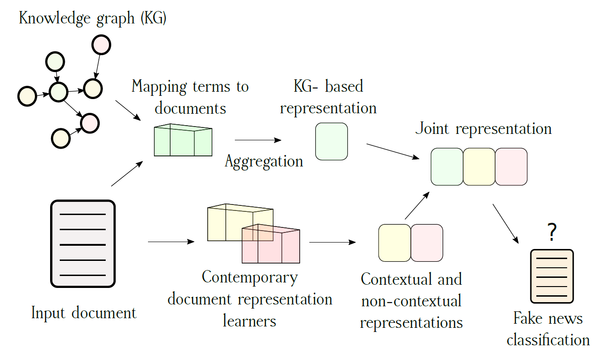

# Knowledge Graph informed Fake News Classification via Heterogeneous Representation Ensembles

Repository containing the code of the paper: **Knowledge Graph informed Fake News Classification via Heterogeneous Representation Ensembles**



## Knowledge graph embeddings

For the purpose of the research we used the GraphVite Wikidata5

* [TransE](https://udemontreal-my.sharepoint.com/:u:/g/personal/zhaocheng_zhu_umontreal_ca/EX4c1Ud8M61KlDUn2U_yz_sBP_bXNuFnudfhRnYzWUFA2A?download=1)
* [DistMult](https://udemontreal-my.sharepoint.com/:u:/g/personal/zhaocheng_zhu_umontreal_ca/EQsXL8UmSJhHt2uBdB32muMBo4o4RUaMR6KDEQTcsz3jvg?download=1)
* [RotatE](https://udemontreal-my.sharepoint.com/:u:/g/personal/zhaocheng_zhu_umontreal_ca/EWvX5Z0rWZ9GvmdLaM3ONx4BtxzDFehXdc0gwE52YEiX2Q?download=1)
* [QuatE](https://udemontreal-my.sharepoint.com/:u:/g/personal/zhaocheng_zhu_umontreal_ca/EUGNHMB9tlJAokjxBouyG08ByfAb3-IYHCszTMmJnQSegg?download=1)
* [ComplEx](https://udemontreal-my.sharepoint.com/:u:/g/personal/zhaocheng_zhu_umontreal_ca/ERAwwLdsvdRIlrkVujMetmEBV9RgizsFnW91pIpjkBjbTw?download=1)
* [SimplE](https://udemontreal-my.sharepoint.com/:u:/g/personal/zhaocheng_zhu_umontreal_ca/EVcJpJAzkThPu1vjgJLohscBgwtPajhTZvCCd8nEg1GiwA?download=1)

Download and save them to kg_dump folder.
## KG-based representations:

### Concept extraction
#### The extraction is represented in *Fuzzy_extractor.ipynb* notebook. 
#### For each dataset KG concepts are are extracted and saved in dataset *kg_emb_dump* folder.
* *dataset_kgmethod.pkl*
  

### Metadata concept extraction
#### The extraction is represented in *Fuzzy_extractor.ipynb* notebook. 
#### Only for the LIAR and the FakeNewsnet, KG concepts are extracted and saved in dataset *kg_emb_dump* folder in a format:.
* *dataset_method_entity.pkl*


## Language representations

### The code for obtaining the language representation of each dataset is to be found in the *Extractor.ipynb* notebook. To extract:

* To extract *KG_REPRESENTATIONS* run the *export_kgs* block at the end of the notebook
* To extract *LANGUAGE_REPRESENTATIONS* run the *export_LM* block at the end of the notebook


### Classifiers

* The neural learners are to be found in the *bind_learn.py* script.
* The LR baselines are in the *cartesian_regression.py* script.

## Citation

```
@article{KOLOSKI2022,
title = {Knowledge graph informed fake news classification via heterogeneous representation ensembles},
journal = {Neurocomputing},
year = {2022},
issn = {0925-2312},
doi = {https://doi.org/10.1016/j.neucom.2022.01.096},
url = {https://www.sciencedirect.com/science/article/pii/S0925231222001199},
author = {Boshko Koloski and Timen {Stepišnik Perdih} and Marko Robnik-Šikonja and Senja Pollak and Blaž Škrlj},
keywords = {Fake news detection, Knowledge graphs, Text representation, Representation learning, Neuro-symbolic learning},
abstract = {Increasing amounts of freely available data both in textual and relational form offers exploration of richer document representations, potentially improving the model performance and robustness. An emerging problem in the modern era is fake news detection—many easily available pieces of information are not necessarily factually correct, and can lead to wrong conclusions or are used for manipulation. In this work we explore how different document representations, ranging from simple symbolic bag-of-words, to contextual, neural language model-based ones can be used for efficient fake news identification. One of the key contributions is a set of novel document representation learning methods based solely on knowledge graphs, i.e., extensive collections of (grounded) subject-predicate-object triplets. We demonstrate that knowledge graph-based representations already achieve competitive performance to conventionally accepted representation learners. Furthermore, when combined with existing, contextual representations, knowledge graph-based document representations can achieve state-of-the-art performance. To our knowledge this is the first larger-scale evaluation of how knowledge graph-based representations can be systematically incorporated into the process of fake news classification.}
}
```
